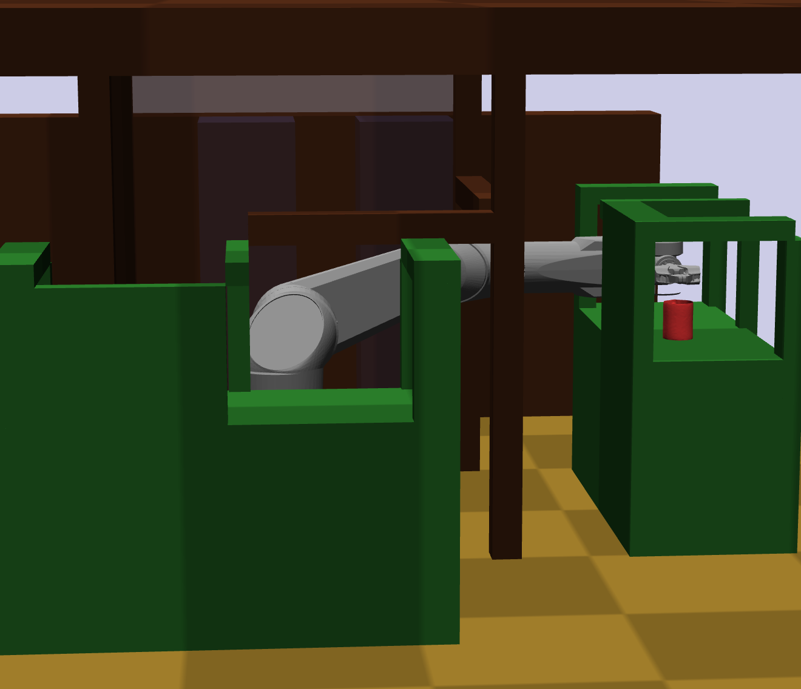
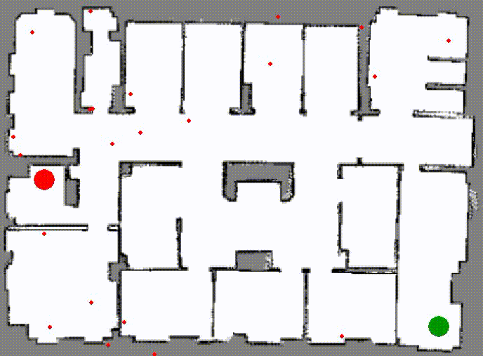
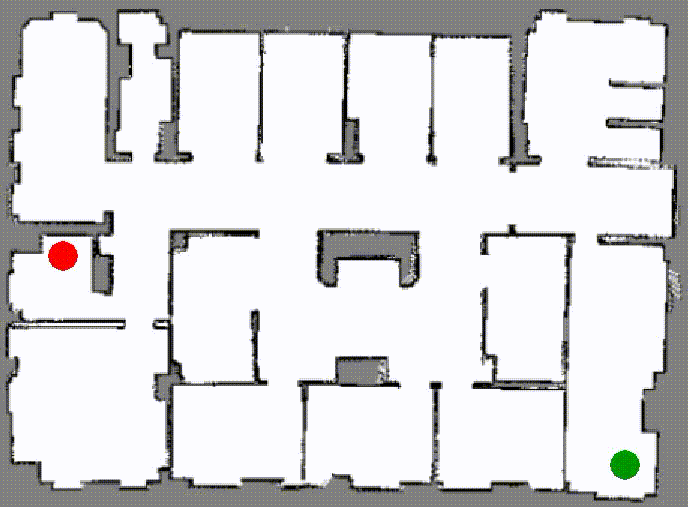

# Sampling-Based Motion Planners' Testing Environment

[](https://cs.tinyiu.com/sbp-env)
[](https://github.com/soraxas/sbp-env/actions/workflows/ci.yaml)
[](https://cs.tinyiu.com/sbp-env)
[](https://github.com/soraxas/sbp-env/commits/master)
[](https://github.com/psf/black)
[](https://github.com/soraxas/sbp-env/blob/master/LICENSE)

Sampling-based motion planners' testing environment (`sbp-env`) is a full feature framework to quickly test different sampling-based algorithms for motion planning. `sbp-env` focuses on the flexibility of tinkering with different aspects of the framework, and had divided the main planning components into two categories (i) **samplers** and (ii) **planners**.

The focus of *motion planning research* had been mainly on (i) improving the sampling efficiency (with methods such as heuristic or learned distribution) and (ii) the algorithmic aspect of the planner using different routines to build a connected graph. Therefore, by separating the two components one can quickly swap out different components to test novel ideas.

Have a look at the [documentations](https://cs.tinyiu.com/sbp-env) for more detail information. If you are looking for the previous code for the RRdT* paper it is now archived at [soraxas/rrdt](https://github.com/soraxas/rrdt).

## Installation

#### Optional

I recommend first creates a virtual environment with

```sh
# assumes python3 and bash shell
python -m venv sbp_env
source sbp_env/bin/activate
```

#### Install dependencies

You can install all the needed packages with pip.

```sh
pip install -r requirements.txt
```

There is also an optional dependency on [`klampt`](https://github.com/krishauser/Klampt) if you want to use the 3D simulator. Refer to its [installation guide](https://github.com/krishauser/Klampt#installation) for details.



## Quick Guide

You can get a detailed help message with

```sh
python main.py --help
```

but the basic syntax is

```sh
python main.py <PLANNER> <MAP> [options]
```

It will open a new window that display a map on it. Every white pixel is assumed to be free, and non-white pixels are obstacles. You will need to use your mouse to select two points on the map, the first will be set as the starting point and the second as the goal point.

## Demos

### Run maps with different available Planners

This repository contains a framework to performs quick experiments for Sampling-Based Planners (SBPs) that are implemented in Python. The followings are planners that had implemented and experimented in this framework.

Note that the commands shown in the respective demos can be customised with additional options. In fact, the actual command format used for the demonstrations is

```sh
python main.py <PLANNER> maps/room1.png start <sx>,<sy> goal <sx>,<sy> -vv
```

to have a fix set of starting and goal points for consistent visualisation, but we omitted the start/goal options in the following commands for clarity.

### RRdT*

```sh
python main.py rrdt maps/room1.png -vv
```

<p align="center">
    
</p>

### RRT*

```sh
python main.py rrt maps/room1.png -vv
```

<p align="center">
    
</p>

### Bi-RRT*

```sh
python main.py birrt maps/room1.png -vv
```

<p align="center">
    
</p>

### Informed RRT*

```sh
python main.py informedrrt maps/room1.png -vv
```

<p align="center">

</p>

The red ellipse shown is the dynamic sampling area for Informed RRT*

### Others

There are also some other planners included in this repository. Some are preliminary planner that inspired RRdT*, some are planners with preliminary ideas, and some are useful for debugging.
